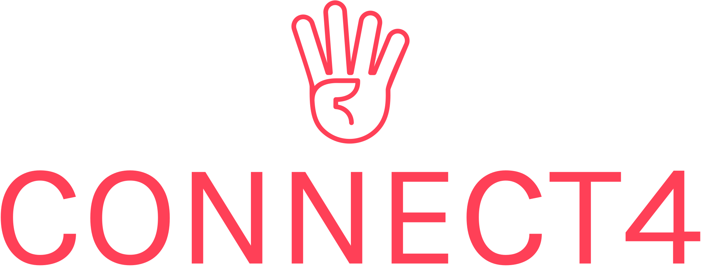

<a name="readme-top"></a>


<!-- PROJECT SHIELDS -->
<!--
*** I'm using markdown "reference style" links for readability.
*** Reference links are enclosed in brackets [ ] instead of parentheses ( ).
*** See the bottom of this document for the declaration of the reference variables
*** for contributors-url, forks-url, etc. This is an optional, concise syntax you may use.
*** https://www.markdownguide.org/basic-syntax/#reference-style-links
-->
[![Contributors][contributors-shield]][contributors-url]
[![Forks][forks-shield]][forks-url]
[![Stargazers][stars-shield]][stars-url]
[![Issues][issues-shield]][issues-url]
[![MIT License][license-shield]][license-url]
[![LinkedIn][linkedin-shield]][linkedin-url]


<!-- PROJECT LOGO -->
<br />
<div align="center">
  <a href="https://github.com/Sin13/connect4">
    
  </a>
  <br />
  <br />

  <!-- <h3 align="center">Connect 4</h3> -->

  <p align="center">
   A web based implementation of the <a href="https://en.wikipedia.org/wiki/Connect_Four"><strong>Connect Four</strong></a> game.
    <br />
    <br />
    <a href="https://youtu.be/eHFJw5kh1Xg">View Introduction</a>
    ·
    <a href="https://github.com/Sin13/connect4/issues">Report Bug</a>
    ·
    <a href="https://github.com/Sin13/connect4/issues">Request Feature</a>
  </p>
</div>


<!-- TABLE OF CONTENTS -->
<details>
  <summary>Table of Contents</summary>
  <ol>
    <li>
      <a href="#about-the-project">About The Project</a>
      <ul>
        <li><a href="#built-with">Built With</a></li>
      </ul>
    </li>
    <li>
      <a href="#getting-started">Getting Started</a>
      <ul>
        <li><a href="#prerequisites">Prerequisites</a></li>
        <li><a href="#installation">Installation</a></li>
      </ul>
    </li>
    <li><a href="#usage">Usage</a></li>
    <li><a href="#roadmap">Roadmap</a></li>
    <li><a href="#contributing">Contributing</a></li>
    <li><a href="#license">License</a></li>
    <li><a href="#contact">Contact</a></li>
    <li><a href="#acknowledgments">Acknowledgments</a></li>
  </ol>
</details>


<!-- ABOUT THE PROJECT -->
## About The Project

[![Product Name Screen Shot][product-screenshot]](http://localhost:3000/)

Connect4 utilizes Node.js with Express.js framework as the back end and uses HTML, CSS (Less), Bootstrap, and JavaScript for the front end.

Socket.io is used for WebSocket-based communication between the front-end and back-end.

For AI,  a machine learning model has been implemented in `./ai_model` but is not yet used in the project as it's not functional and requires further improvements and training. Therefore <a href="https://github.com/DaveTrost/connect4-ai">connect4-ai</a> module (by Dave Trost) has been utilized as a connect-4 bot for players to play against.

<p align="right">(<a href="#readme-top">back to top</a>)</p>


### Built With

* [![Node][Node.js]][Node-url]
* [![Express][Express.js]][Express-url]
* [![Socket][Socket.io]][Socket.io]
* [![HTML5][HTML5]][HTML5-url]
* [![CSS3][CSS3]][CSS3-url]
* [![JavaScript][JavaScript]][JavaScript-url]
* [![Bootstrap][Bootstrap.com]][Bootstrap-url]

<p align="right">(<a href="#readme-top">back to top</a>)</p>


<!-- GETTING STARTED -->
## Getting Started


### Prerequisites

* npm

  ```sh
  npm install npm@latest -g
  ```

### Installation

1. Clone the repo

   ```sh
   git clone https://github.com/Sin13/connect4.git
   ```
2. Go to the project directory

   ```sh
   cd ./web_app/
   ```
3. Install NPM packages

   ```sh
   npm install
   ```

<p align="right">(<a href="#readme-top">back to top</a>)</p>


<!-- USAGE EXAMPLES -->
## Usage

1. Run the application
   ```sh
   npm start
   ```
2. Go to application url
   <a href="http://localhost:3000/">http://localhost:3000/</a>

3. Have Fun :)

<p align="right">(<a href="#readme-top">back to top</a>)</p>


<!-- ROADMAP -->
## Roadmap

- [ ] Add Changelog
- [ ] Host The Website
- [ ] Add PvP Support
- [ ] Add Global LeaderBoard
- [ ] Add Player Chat
- [ ] Fix and Utilize the Machine Learning Model in `./ai_model`

<p align="right">(<a href="#readme-top">back to top</a>)</p>


<!-- CONTRIBUTING -->
## Contributing

Contributions are what make the open source community such an amazing place to learn, inspire, and create. Any contributions you make are **greatly appreciated**.

If you have a suggestion that would make this better, please fork the repo and create a pull request. You can also simply open an issue with the tag "enhancement".
Don't forget to give the project a star! Thanks again!

1. Fork the Project
2. Create your Feature Branch (`git checkout -b feature/AmazingFeature`)
3. Commit your Changes (`git commit -m 'Add some AmazingFeature'`)
4. Push to the Branch (`git push origin feature/AmazingFeature`)
5. Open a Pull Request

<p align="right">(<a href="#readme-top">back to top</a>)</p>


<!-- LICENSE -->
## License

Distributed under the MIT License. See `LICENSE.txt` for more information.

<p align="right">(<a href="#readme-top">back to top</a>)</p>


<!-- CONTACT -->
## Contact

Sina Jalali -  sina.jalali1998@gmail.com

Project Link: [https://github.com/Sin13/connect4](https://github.com/Sin13/connect4)

<p align="right">(<a href="#readme-top">back to top</a>)</p>


<!-- ACKNOWLEDGMENTS -->
## Acknowledgments

* [Less](https://lesscss.org/)
* [Best-README-Template](https://github.com/othneildrew/Best-README-Template/)
* [Img Shields](https://shields.io)
* [Badges 4 README.md Profile](https://github.com/alexandresanlim/Badges4-README.md-Profile/)
* [Animated CSS Gradient Border](https://codepen.io/mike-schultz/pen/NgQvGO/)
* [CSS Text Drop Animation](https://codepen.io/lenasta92579651/pen/GRMByxX/)
* [Neon text flicker glow](https://codepen.io/ganceab/pen/YZvKLQ/)
* [Artificial Intelligence Logo Maker](https://logo.com/logos/artificial-intelligence/)

<p align="right">(<a href="#readme-top">back to top</a>)</p>


<!-- MARKDOWN LINKS & IMAGES -->

<!-- https://www.markdownguide.org/basic-syntax/#reference-style-links -->
[contributors-shield]: https://img.shields.io/github/contributors/Sin13/connect4?style=for-the-badge
[contributors-url]: https://github.com/Sin13/connect4/graphs/contributors
[forks-shield]: https://img.shields.io/github/forks/Sin13/connect4?style=for-the-badge
[forks-url]: https://github.com/Sin13/connect4/network/members
[stars-shield]: https://img.shields.io/github/stars/Sin13/connect4?style=for-the-badge
[stars-url]: https://github.com/Sin13/connect4/stargazers
[issues-shield]: https://img.shields.io/github/issues/Sin13/connect4?style=for-the-badge
[issues-url]: https://github.com/Sin13/connect4/issues
[license-shield]: https://img.shields.io/github/license/Sin13/connect4?style=for-the-badge
[license-url]: https://github.com/Sin13/connect4/blob/master/LICENSE.txt
[linkedin-shield]: https://img.shields.io/badge/-LinkedIn-black.svg?style=for-the-badge&logo=linkedin&colorB=555
[linkedin-url]: https://linkedin.com/in/sinajalali
[product-screenshot]: images/screenshot.png
[Node.js]: https://img.shields.io/badge/Node.js-339933?style=for-the-badge&logo=nodedotjs&logoColor=white
[Node-url]: https://nodejs.org/
[Express.js]: https://img.shields.io/badge/Express.js-000000?style=for-the-badge&logo=express&logoColor=white
[Express-url]: https://expressjs.com/
[Socket.io]: https://img.shields.io/badge/Socket.io-010101?&style=for-the-badge&logo=Socket.io&logoColor=white
[Socket.io-url]: https://socket.io/
[HTML5]: https://img.shields.io/badge/HTML5-E34F26?style=for-the-badge&logo=html5&logoColor=white
[HTML5-url]: https://en.wikipedia.org/wiki/HTML5/
[CSS3]: https://img.shields.io/badge/CSS3-1572B6?style=for-the-badge&logo=css3&logoColor=white
[CSS3-url]: https://en.wikipedia.org/wiki/CSS/
[JavaScript]: https://img.shields.io/badge/JavaScript-323330?style=for-the-badge&logo=javascript&logoColor=F7DF1E
[JavaScript-url]: https://en.wikipedia.org/wiki/JavaScript/
[Bootstrap.com]: https://img.shields.io/badge/Bootstrap-563D7C?style=for-the-badge&logo=bootstrap&logoColor=white
[Bootstrap-url]: https://getbootstrap.com
